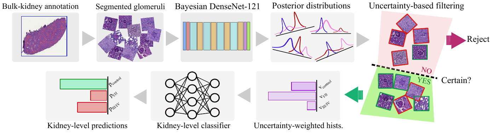

# Kidney Level Lupus Nephritis Classification using Uncertainty Guided Bayesian Convolutional Neural Networks

## The kidney biopsy based diagnosis of Lupus Nephritis (LN) is characterized by low inter-observer agreement, with misdiagnosis being associated with increased patient morbidity and mortality. Although various Computer Aided Diagnosis (CAD) systems have been developed for other nephrohistopathological applications, little has been done to accurately classify kidneys based on their kidney level Lupus Glomerulonephritis (LGN) scores. The successful implementation of CAD systems has also been hindered by the diagnosing physician's perceived classifier strengths and weaknesses, which has been shown to have a negative effect on patient outcomes. We propose an Uncertainty-Guided Bayesian Classification (UGBC) scheme that is designed to accurately classify control, class I/II, and class III/IV LGN (3 class) at both the glomerular-level classification task (26,634 segmented glomerulus images) and the kidney-level classification task (87 MRL/lpr mouse kidney sections). Data annotation was performed using a high throughput, bulk labeling scheme that is designed to take advantage of Deep Neural Network's (or DNNs) resistance to label noise. Our augmented UGBC scheme achieved a 94.5% weighted glomerular-level accuracy while achieving a weighted kidney-level accuracy of 96.6%, improving upon the standard Convolutional Neural Network (CNN) architecture by 11.8% and 3.5% respectively.